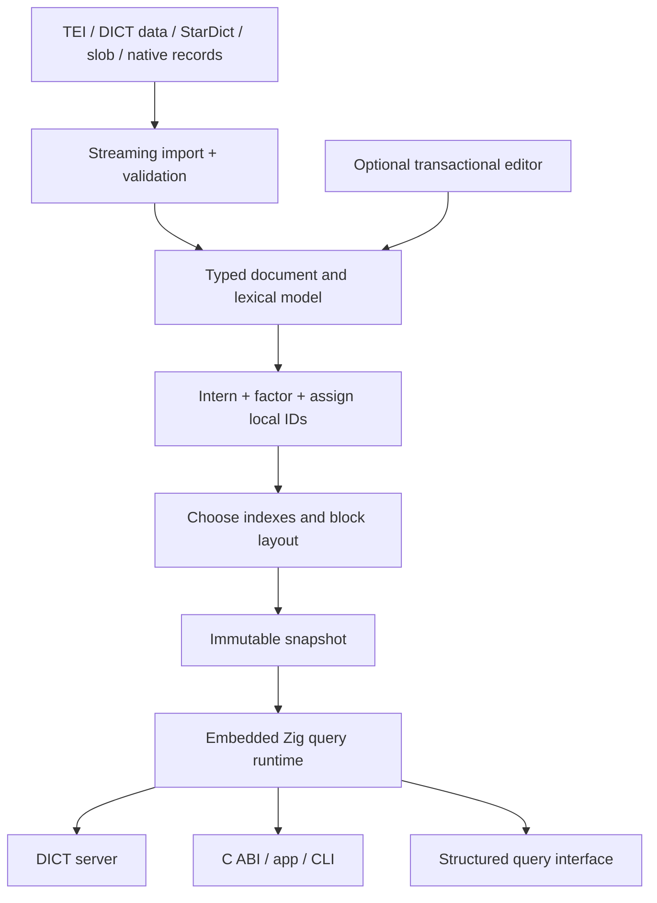

# A compact lexical database and DICT replacement in Zig

Design proposal · 5 September 2026 · working name: **Lexicon**

This is an implementation plan, not a completed engine or a performance result. Four Luna research agents investigated compression, competitors/protocols, lexical semantics, and Zig/database architecture. Their evidence notes accompany this plan. All new storage schemes and numerical gates below are proposals to validate. Where exploratory agent notes offer different choices, this document selects the intended design.

The recommended product is a **compiler for lexical data plus a small embedded query runtime**. It compiles multilingual lexical documents and relationships into immutable, bit-packed snapshots. Searchable structure stays directly addressable; bzip3 compresses independently addressable text blocks. A DICT server is one adapter around that runtime. An optional editor maintains transactions and publishes new snapshots.

The ambition is to outperform StarDict, slob, and dictd on measured lexical workloads while preserving substantially richer semantics. Simultaneously beating every database on every feature, minimum bytes, latency, and implementation simplicity is not a satisfiable guarantee. Additional indexes consume space; global compression conflicts with cold random access; history retains old values; arbitrary queries can require scans. The design makes those costs visible and optimizes within declared constraints.

## 1. Turn the requirements into executable contracts

| Requirement | Concrete contract | Verification |
|---|---|---|
| Effective bzip3 use | Primary codec for compressible lexical payloads; indexed independent blocks; measured placement and block-size selection | Codec/block/layout ablations including all overhead |
| Fast lookup | Exact and prefix lookup without definition decompression; bounded payload decode per bounded result | Cold/warm latency, bytes read and decoded, cache misses |
| Extremely compact | Schema-implied types, implicit ownership, local IDs, bit-packed columns, shared values and structures | Byte ledger by section and bits per item |
| No redundant data | One authoritative immutable value per exact interned value; identity-bearing occurrences remain distinct | Canonicalization and semantic round-trip properties |
| Complex relationships | Typed directed relations, n-ary assertions, edge attributes, evidence, order, uncertainty, cycles | Query oracle and round-trip fixtures |
| DICT replacement | RFC 2229 wire behavior plus explicitly inventoried dictd deployment behavior | Real clients and differential transcripts |
| Embeddable | Zig library and stable C ABI; no mandatory server, background threads, or network | C/Zig sample applications and memory ceilings |
| First-class multilingual | Language/script/dialect and analysis profile are data, not process locale | Unicode conformance and language-specific fixtures |
| Rich queries | Typed relational operators, graph traversal, document navigation and fielded text search | Same answers with indexes enabled/disabled |
| TEI/Kirrkirr information | Lossless supported document structure and rich lexical views; explicit handling of extensions | Semantic and optional byte-exact round trips |
| Low implementation complexity | Small stable reader; bounded codec/operator set; build-time optimization | Dependency, binary, code and fuzz-surface ledger |
| Robustness | Bounds-checked format, resource budgets, snapshot isolation and crash testing | Fault injection, fuzzing, deterministic replay |

“Zero redundancy” means zero unnecessary duplication of authoritative values in a compacted snapshot. It cannot mean zero physical redundancy: references, search keys, checksums, rank directories, backups, and caches carry real information or accelerate access. Repeated identical spellings also do not imply identical senses or assertions.

Publish three build presets using the same format, query semantics, and reader: **compact**, **balanced** (default), and **latency**. Do not use one preset's size and another's speed to claim a simultaneous win. An unindexed query remains correct through a scan, or is rejected before execution when the caller forbids scans; a preset must never silently change answers.

## 2. Lessons from the requested references

Assumption: “Xit” means [Xit](https://github.com/xit-vcs/xit) and [xitdb](https://github.com/xit-vcs/xitdb), and “tigerbeatle” means [TigerBeetle](https://github.com/tigerbeetle/tigerbeetle). If different projects were intended, that part of the comparison needs revision.

xitdb demonstrates an embedded immutable database with persistent data structures and historical roots, but explicitly has no query engine. Borrow cheap snapshot publication and an ordinary library interface. Evaluate it as a build/editor staging store; do not make a general persistent object graph the mandatory distribution format. Dense compiled columns should have less pointer and per-object overhead. This is a design hypothesis, not an xitdb benchmark. [xitdb source](https://github.com/xit-vcs/xitdb)

Borrow bounded resource use, explicit state transitions, checksummed storage and deterministic fault simulation from TigerBeetle. Its distributed financial machinery solves a different problem; replication and consensus are separate optional products, not requirements for opening a local dictionary. [TigerBeetle architecture](https://github.com/tigerbeetle/tigerbeetle/blob/main/docs/ARCHITECTURE.md), [storage layout](https://github.com/tigerbeetle/tigerbeetle/blob/main/docs/internals/data_file.md)

## 3. Product architecture



Ship these independently:

- `liblex`: read-only snapshot validation, lookup, typed queries and streaming rendering.
- `lex build`: importer, canonicalizer, optimizer, deterministic encoder and build report.
- `lex inspect`, `verify`, `query`, `export`, `bench`: operational tools.
- `lex serve --dict`: DICT wire protocol and deployment adapter.
- `lex edit`: optional single-writer transactional workspace and snapshot publication.
- Language analysis packs and import/render adapters, versioned separately from the core format.

The reader must never need XML parsing, schema compilation, index construction or compaction merely to open a file. Rich language support has a real size cost; show library size with and without each language pack.

## 4. A model that preserves lexical information

### 4.1 Separate value identity, occurrence identity, and search equivalence

Use three distinct concepts:

1. **Value**: immutable bytes or a typed scalar/sequence. Exact equal values may be shared.
2. **Occurrence/entity**: a particular entry, sense, form, citation, or source node, with stable identity and context. Equal-looking occurrences are not merged.
3. **Search key**: a derived equivalence class under a named normalization/analysis profile. Different values can match the same key without becoming the same value.

`bank` in two senses may reference one byte string but retains two sense identities. Two identical quotations from distinct sources retain two evidence occurrences. A composed and decomposed spelling can match under NFC while preserving original code points. Translation is a scoped assertion, not string equality and not automatically reversible; its target may be a resolved sense or an unresolved quoted lexicalization.

Stable external IDs survive rebuilds. Internal IDs are dense integers local to a snapshot/type or segment and may change at compaction. Store external-ID mapping only where external identity is needed; never use a 128-bit UUID on every internal edge. Content hashes identify immutable values and verify builds; dense IDs carry routine references. Deduplication confirms byte equality after hashes match, including adversarial collision tests.

### 4.2 Core types and extension mechanism

Core entity kinds: `Lexicon`, `Lexeme`, `Entry`, `Scope` (including homograph/subentry), `Sense`, `Form`, `Pronunciation`, `Example`, `Citation`, `TranslationAssertion`, `EtymologyEvent`, `Usage`, `FeatureBundle`, `Source`, `Agent`, `Media`, `DocumentNode`, and `Annotation`.

Primitive values: exact UTF-8, bytes, boolean, signed/unsigned integer, decimal with scale, float with explicit comparison semantics, qualified name, language tag, URI, date/time with precision, interval, enum, tagged union, ordered sequence, set, and typed entity reference. A date such as “circa 1700” is not silently converted into an exact timestamp. Unknown values, absent values, and explicit editorial uncertainty are distinct.

Schema fields declare cardinality, ordering, type, permitted targets, inheritance rules and optional constraints. Preserve feature alternatives, feature negation, notation such as IPA, and partial-date/uncertainty types rather than flattening them into a POS enum. User-defined namespaces/types extend the model without adding a built-in opcode per TEI element. Unknown elements remain typed generic document nodes; an uninterpreted string attribute is not falsely promoted to a known lexical meaning.

A lexeme is distinct from a source's presentation entry. An explicit assertion may align lexemes across sources without merging their editorial entries. Recursive forms and entry/homograph/sense/subsense scopes retain where each grammatical or usage claim applies. Preserve `entryFree` and `dictScrap` as legitimate source structures; inheritance follows declared field/profile semantics, never a blanket rule for every attribute.

Relations have an entity ID when they need evidence or attributes. An n-ary etymology event can connect multiple source forms, a target form, languages, a date range and a confidence annotation. Simple binary relations use compact adjacency. Preserve parallel assertions if evidence, source, occurrence or ordering differs. Inverse predicates can be declared as views; materialize reverse access only when beneficial. Unresolved references retain their source target text/URI, display label and resolution status. Conflicting, retracted and inferred assertions remain distinct and queryable. No automatic transitive closure of translation, synonymy or etymology.

### 4.3 Preserve documents without storing a second semantic copy

TEI permits structured and much freer dictionary entries; a fixed `word -> definition` schema cannot preserve its information. [TEI entryFree](https://tei-c.org/release/doc/tei-p5-doc/en/html/ref-entryFree.html)

Represent an ordered document forest with namespace-qualified node names, attributes, text references, comments/processing instructions when retained, and ordered child sequences. Lexical fields are typed views onto these nodes and values. Native records can inhabit the same representation or reference shared immutable content structures. Editorial and normalized lexical views may differ in grouping/order; retain explicit transformation links and distinct roots with shared values, including source anchors for transpositions. Do not persist both a full DOM and an independently copied lexical object graph. If compilation creates a synthetic sense owner for unscoped data, mark it as derived; export must not pretend the source contained that element.

Expose all retained document material to queries, including namespaced extensions, milestones, inline markup, cross-references, uncertainty and provenance. The generic attribute layer preserves all attributes, including source IDs, numbering, sort keys, original/normalized forms, splitting/merging hints, optionality, source locations and linking attributes. Comments and processing instructions follow an explicit import-profile preservation contract; strict preservation never silently drops them. For recognized profiles, compile document paths into typed field access. Store mapping metadata and node identity, not another definition string.

Define two preservation modes:

- **Semantic preservation** retains text, mixed-content order, attributes, namespaces, references and documented editorial structure, but may serialize with different quoting or prefix choices.
- **Byte-exact preservation** also retains a lexical token tape or reconstruction residual for encoding, whitespace, entity spelling, attribute order and other serialization details. Validate by exact byte comparison. This option has a measured cost and is not needed to preserve meaning.

A generic token tape must cover the entire source syntax it claims to reproduce. Keeping an opaque original file alongside everything else is an acceptable explicit archival fallback, but is counted as duplication and cannot be used to claim the smallest representation. External entities are resolved only under controlled import policy; no runtime network dependency is needed to interpret an archived snapshot.

### 4.4 Factor repeated structure with context intact

Intern immutable feature bundles and identical ordered content fragments. A repeated grammar bundle becomes one bundle plus occurrence references. Language, source and usage defaults can be scoped at lexicon, entry or sense; store exceptions and make effective values queryable. The compiler verifies expanded values against the unfactored model.

Do not hash-cons a contextual node merely because its local bytes match. Factor content separately from occurrence annotations. Limit expansion depth and output bytes; shared DAGs can otherwise become decompression bombs. Cyclic semantic relations remain ordinary references, not recursively expanded content. Intern immutable acyclic fragments bottom-up; cycles require explicit IDs and no recursive content hashing.

### 4.5 Worked example: shared spelling, distinct knowledge

Suppose source A has two English senses of “bank”: a financial institution and a river edge. Source B repeats the financial definition but assigns its own citation and usage label. A French translation quotation “banque” is supplied only for A's financial sense; it has no resolved target entry.

The compiler stores one exact byte value for “bank” and one for each distinct definition text. It keeps three sense occurrences, their source entries, and the distinct evidence/usage associations. The translation assertion references A's financial sense and a language-tagged quoted value; it does not invent a French sense or attach the translation to the river sense. Source B can share definition content without inheriting A's translation.

An English exact lookup first returns the associated occurrence IDs from the key index. A query requiring a French translation filters those IDs through the assertion relation before any definition decode. Only the selected sense's payload blocks are then fetched. DICT renders its configured textual projection; a structured query returns the translation's unresolved status and evidence. A source export reconstructs original ordering and identity. This same example is a mandatory regression fixture for interning, joins and rendering.

## 5. Multilingual behavior is explicit and reproducible

Store original Unicode text. Keep notation, writing direction and transliteration profile distinct from language. Attach language/script/orthography information at the smallest relevant scope, with inherited defaults. Multiple languages can occur within one definition. Preserve supplied language-tag spelling if exact provenance matters while using validated identifiers for lookup.

A search profile contains: Unicode data version; normalization; case policy; optional diacritic treatment; tokenization; transliteration; collation; morphology pack version; and indexing parameters. Its digest is part of index identity. Missing or incompatible analysis data causes a specific error, not fallback to the host locale.

Normalization and segmentation have published conformance requirements; use their official tests. Compatibility normalization can discard meaningful distinctions, so it must not overwrite source text. [Unicode normalization](https://www.unicode.org/reports/tr15/), [Unicode segmentation](https://www.unicode.org/reports/tr29/)

Offer literal, canonically equivalent, locale-aware case-insensitive, and explicitly loose search. Fuzzy distance declares whether units are bytes, scalar values or grapheme clusters. Default end-user fuzzy matching should use a documented grapheme-aware profile; an exact DICT compatibility strategy may require different legacy behavior. Arabic marks, Turkish I, German sharp s, Greek sigma, Indic conjuncts, Thai boundaries, Chinese segmentation, Japanese readings, combining marks and mixed-direction examples belong in acceptance fixtures.

Keep language-specific morphology and transliteration optional. Generic Unicode support is first-class for every language; a tokenizer alone does not imply linguistic analysis for every language. Distinguish direct orthographic hits, aliases, transliterations and generated forms in results. Return matching evidence and analysis version. A translation assertion records its source scope, target language/variety/script, target lexicalization(s) and translation-specific grammatical/usage qualifiers explicitly.

Build shared equivalent normalized key sets only when the complete transformation profiles produce compatible key semantics. Do not combine collations merely because two languages use the same script. Multilingual sort order needs locale data and a stable ID tie-breaker. Prefix search uses its own prefix-preserving key representation; a collation sort key is not automatically a valid prefix index.

## 6. Disk format: spend bits where they do work

### 6.1 Container

A proposed `.lex` file has a fixed small header followed by a section directory and immutable sections. Freeze exact field offsets only after the first format prototype, before compatibility promises.

Header fields: magic; major/minor version; endianness convention; required/optional feature masks; file length; directory offset/length; root integrity digest; build/profile identifier. Use little-endian explicit loads, 64-bit outer offsets and checked arithmetic. The reader does not reinterpret bytes as native Zig structs.

Directory entries identify section kind, encoding version, offset, compressed/logical length, item count, parameters and checksum. A required unknown section/codec prevents opening; an unknown optional section can be skipped only when its feature is not requested. Verify offset overlap, integer overflow, truncation, counts and declared resource bounds.

Sections cover schema, languages/analysis identities, search keys, source/external-ID mappings, occurrence/type maps, scalar columns, ordered structure, relation columns, postings, atom directories, bzip3 payloads, media and metadata. Sections can be paged where lazy verification/access is useful. A root digest authenticates content only when its expected value or signature comes from a trusted source; checksums alone detect accidental corruption.

### 6.2 A deliberately short codec menu

| Structure | Initial encoding | Optional measured improvement |
|---|---|---|
| Constant column | One value in descriptor | None |
| Small enum / local IDs | Fixed-width packed integers | Run encoding for long runs |
| Sparse optional column | Presence bitmap plus present values | Sparse sorted row IDs |
| Sorted offsets / postings | Blocked delta-packed integers | Elias–Fano |
| Unsorted numeric column | Frame-of-reference bit packing | Exception blocks if justified |
| Small lists | Inline descriptor or short packed sequence | None |
| Large text | Independent bzip3 blocks | Chosen semantic ordering and block sizes |
| Search keys | Front-coded sorted keys with restart points | Minimal automaton/FST |
| Dense sets | Bitmap | Optional compressed bitmap containers |
| Graph targets | Packed source-grouped target sequence | Wavelet representation for two-way access |
| Ordered forest | Packed parent/child or subtree boundaries | Balanced parentheses with rank/select |
| Already compressed media | Raw stored bytes | Never force recompression that expands |

Choose one primary encoding per structure in v0.1. Add a new decoder only when total-file and latency results justify its implementation and test cost. Bitpacking every field into an exotic variable-length grammar would undermine the complexity requirement. For bzip3-bound payload columns, compare byte-coded and bit-packed input: denser bits can remove byte patterns useful to the compressor. Select using final stored bytes and decode cost, including the representation flag.

A column of 1,000,000 IDs with 700 possible values needs 10 bits/value: 1,250,000 bytes before metadata, versus 4,000,000 with `u32`. This is arithmetic, not a dataset forecast. If the column is constant its per-row width is zero. Nullability needs a separate presence representation unless the schema explicitly reserves a code.

For n monotone positions in universe U, Elias–Fano uses approximately n(log2(U/n)+2) bits before access metadata under its usual conditions. It is a candidate for long sparse sequences; tiny lists often favor simple deltas. [Quasi-succinct indices](https://arxiv.org/abs/1206.4300)

Byte-align block boundaries and metadata; pack inside blocks. Provide scalar reference unpackers, then optional SIMD implementations with differential tests. Cover width zero, maximum width, tails, shifts by word size and truncated input. Never read past a mapping to simplify vector decoding.

### 6.3 Avoid paying for a pointer on every fact

Group entities by type and owner where useful. Contiguous child ownership can be represented by boundaries instead of a parent ID per child. A column's type and predicate are implied by its descriptor, not repeated per value. Local string dictionaries store compact references rather than global hash IDs. Use sparse escape tables for exceptional cardinalities or distant references.

A 100-value local vocabulary requires 7-bit local references, but its local-to-global map also costs bytes. Use local dictionaries only when reference savings exceed that map plus decode overhead. Identity remapping, sort permutations and directory entries belong in the ledger; they are not free compression.

## 7. Make bzip3 effective without making lookup hostage to it

### 7.1 Integration boundary

Use upstream libbz3 through a narrow Zig C wrapper first. The low-level API supports independent block encode/decode, has bounds and state-sizing functions, and requires scratch capacity beyond the nominal original length for some inputs. Pin the exact API revision and use its stated buffer bound. The library's minimum state/block setting differs from the command-line minimum, so do not use CLI limits as format limits. [libbz3 header](https://github.com/iczelia/bzip3/blob/master/include/libbz3.h), [bzip3 manual](https://github.com/iczelia/bzip3/blob/master/bzip3.1.in)

One decoder state per concurrently active decode; a bounded pool limits aggregate memory. Inspect advertised lengths before allocation. Account for codec state, input/output buffers, cached output, query arena and mapped resident pages. Pool states by permitted block-size classes to avoid reserving a giant state for every small lookup. The container records codec wire-format identity and supported parameters; the build manifest records the C library ABI/version. These are different compatibility contracts. The core engine is Zig; the initial codec implementation is C. A pure-Zig rewrite is a later, separately tested codec project.

Record the upstream LGPL license and notices in the dependency manifest and choose a distribution/linking arrangement before shipping. Do not promise a dependency-free or automatically permissive-only artifact simply because the caller uses Zig. [Upstream license notice](https://github.com/iczelia/bzip3/blob/master/include/libbz3.h)

### 7.2 Store each payload once, place it intelligently

Classify content by access role, not by a duplicate hot/cold copy:

- Search keys, owner IDs, small scalar filters and graph navigation remain directly addressable.
- Short display labels share the search/atom store where byte identity permits.
- Definition text, examples, etymological prose and long extension text occupy bzip3 blocks.
- Already compressed audio/images/video remain raw content-addressed blobs.

Do not compress the only block directory inside the blocks it locates. Do not claim to search inside an ordinary bzip3 stream: a BWT stage in a compressor is not an FM-index exposing searchable rank/select operations.

Build a deterministic placement graph: content atoms are vertices, co-render/co-query occurrences are weighted edges. Partition under block-size and memory constraints. Use bounded heuristics with fixed tie-breakers, starting with entry-local order, then language/field grouping. Shared high-fanout atoms live in explicitly addressable shared blocks. Measure the resulting dependency count: aggressive sharing can turn one entry fetch into many decompressions.

Each block directory record contains a codec wire-version reference, compressed offset/length, original length, permitted state-size class, integrity digest and item-directory reference/count. The item directory identifies logical atom IDs and decoded ranges. Widths/constant parameters can be shared by a directory page, while outer section bounds remain fixed-width. Derive and validate scratch capacity from these parameters and the pinned codec API before allocation.

An entry references `(block_id, item_id)` through packed atom directories. Each decoded block has item boundaries and optional compact internal dictionaries. IDs and ordering maps are included in size. Most small entries should need one or a few payload blocks; huge entries stream across bounded blocks and cannot honestly have constant total decode cost.

Avoid splitting all prose into globally interned words by default. It introduces token IDs, boundaries and cross-block dependencies and may weaken bzip3's natural text compression. Compare whole repeated strings, repeated fragments and untouched field text. Interning is selected by total savings, not by the number of duplicate tokens found.

### 7.3 Select block sizes from a latency budget

Sweep legal configurations near the library minimum, then 128 KiB, 256 KiB, 512 KiB, 1 MiB and 4 MiB; add larger sizes for archive builds only when worthwhile. Distinguish configured decoder capacity from actual block payload length. Size classes are a proposal, not measured optima.

For a payload miss:

`T ≈ index_time + I/O_time + sum(decoded_block_bytes / measured_decode_rate) + materialization_time`

`decode_amplification = total_decoded_bytes / useful_payload_bytes_returned`

For illustration only, at an assumed 100 MiB/s decode rate, decoding 1 MiB costs roughly 10 ms before other work. Faster key lookup cannot remove that cost. Set a cold-latency budget first and solve for allowable decode bytes using measured hardware data.

Choose boundaries by comparing actual compressed candidates, not just uncompressed record size. For each candidate include block metadata, atom pointers, reconstruction cost and worker memory. Cache repeated computations in the builder; limit search effort. Use a compact deterministic optimization manifest so builds are reproducible. Formally, minimize total stored bytes subject to measured latency, decoder-memory, build-time and dependency-count budgets. Start with greedy adjacent block merges/splits and bounded local placement swaps; accept a change only when its total cost improves and all constraints still hold. This is an implementable heuristic, not a claim of a globally optimal graph partition.

Bzip3 should earn its position against raw, dictzip, zstd and lz4 baselines. If bzip3 misses the target under the user's required profile, report that failure. Do not silently benchmark an alternate codec and call it a bzip3 win. An optional latency profile may use raw tiny values while bzip3 remains the large-text codec; its tradeoff is disclosed.

### 7.4 Cache and batches

Cache decoded blocks by snapshot identity and block ID. Admit based on measured reuse/cost; scans should not flush frequently used lookup blocks. Coalesce concurrent misses for the same block. Sort internal batch fetches by block and restore requested output ordering. Track queue time separately from decode time. Query cancellation prevents future decodes but may have to wait for the current non-interruptible codec call; bound block sizes accordingly.

A build-time access profile is optional and explicit. Do not bake private usage telemetry into distributed dictionaries. Validate layouts on held-out workloads as well as uniform random access.

## 8. Indexes that reuse representation

### 8.1 Search keys

Start with sorted front-coded UTF-8 keys, restart points and compact key-to-occurrence postings. Exact and prefix lookup must establish membership without decoding definitions. Do not use a minimal perfect hash alone: it maps unknown strings too and cannot prove membership without key verification; it also does not solve prefix enumeration.

Benchmark a minimized acyclic automaton/FST after the simple baseline. A lexicographic rank can identify a posting range without storing a full pointer on every terminal. Account for subtree counts, outputs and reconstruction data. A single-byte trie is not automatically fast for grapheme fuzzy search; profile transformations define the comparison units.

Suffix, substring and full-text indexes are optional accelerators over the same authoritative data. Suffix may use reversed keys; arbitrary substring can use n-grams with exact verification or a dedicated text index. These consume bytes. A bounded scan is the correctness fallback. A precomputed deletion dictionary for fuzzy matching is not a free feature.

### 8.2 One relation target sequence for both directions

For predicate p, group edges by source and store source IDs/boundaries plus the target sequence T. Keep edge attributes in the same edge-position order. The baseline uses packed T and optional reverse edge-position postings.

Experimental replacement: encode T in a wavelet matrix supporting access/rank/select. Forward traversal reads T over a source range. Reverse traversal selects positions containing target t, then finds their source by predecessor search in boundaries. Thus the encoded target sequence itself supports both directions, without retaining a second complete target/source table. Preserve occurrence order where required, or store the necessary permutation explicitly. [Wavelet matrix research](https://repositorio.uchile.cl/handle/2250/133661)

This saves a transpose only when its rank/select overhead and CPU cost beat the baseline. Forward reads can be slower, roughly logarithmic in the target alphabet for basic access; reverse results also pay source-boundary lookup. Do not claim both optimal time and zero index redundancy. Tiny relations stay simple packed lists.

Evaluate k²-tree style matrices only for large suitably clustered binary relations; sparse lexical graphs may not share Web graph locality. Ordered multiedges and attributes require extra structures, so a binary matrix alone is insufficient. [Compact graph research](https://arxiv.org/abs/1105.4004)

### 8.3 Text and document indexes

The initial full-text index uses a sorted term dictionary keyed by field/language/analysis-profile identity, term-to-posting boundaries, delta-packed sorted node IDs, and grouped delta-packed token positions where phrase acceleration is enabled. Node ownership maps those IDs to senses without copying content. Fielded full text maps analyzed terms to node/sense IDs and optional positions. Positions retain field and source-span meaning, including mixed content. Phrase search uses positions or verifies candidates against text; no cross-sense false phrase matches. Reverse-definition search is an ordinary field query.

Parent/child order can begin with packed boundaries. A balanced-parentheses tree is a later option for structural navigation, not a replacement for typed cross-links. Schema-level field indexes and generic document paths share source node IDs.

Index selection follows workload benefit per stored byte. Remove overlapping prefix indexes where an existing ordered index suffices. Include statistics size and planner cost. SQLite's covering-index and WITHOUT ROWID designs are useful comparison points, not reasons to benchmark an intentionally poor SQLite schema. [SQLite query planning](https://www.sqlite.org/queryplanner.html), [WITHOUT ROWID](https://www.sqlite.org/withoutrowid.html)

## 9. Query language and execution

### 9.1 A small typed algebra with two front doors

Define a typed internal query plan first. Provide a prepared builder API and a readable textual language, tentatively `LexQL`. The following syntax illustrates desired semantics; it is not an implemented parser or a frozen grammar.

```text
from Form as f
where f.language matches "tr"
  and match(f.written, $word, profile: "tr-canonical-case")
join f.entry.senses as s
join s.translations as t
where t.target.language matches "en"
select f.written, s.id, t.target, t.evidence
order by s.id, t.id
limit 20
```

```text
from Sense as s
where text(s.definition, $terms, mode: phrase, language: "en")
  and exists(s.usage where domain = "botany")
select s.entry.headwords, s.definition, s.sources
```

```text
from Sense as s
where s.id = $sense
traverse s via etymological_source depth 1..4 cycle unique_nodes
select node.id, node.forms, path.evidence
```

```text
from DocumentNode as n
where n.name = qname("http://www.tei-c.org/ns/1.0", "cit")
  and exists(n.attributes[qname("", "type")] = "translation")
select n.parent, n.children, n.source_location
```

Required operators: scan/seek, projection, scalar predicates, exists, joins and semijoins, list unnest, union/intersection/difference, grouping/aggregates, explicit ordering, bounded graph traversal, document axes, and fielded text matching. Add regex with a documented dialect and bounded execution engine. Avoid an unbounded backtracking regex engine.

Expose source text, normalized text and rendered views as distinct operations. Ordered `children`/`content` access, unresolved references with display labels, provenance, certainty, disputed/retracted status, asserted/inferred status and language-fallback evidence are required typed query capabilities. Define `occurrences` and explicit `distinct_by(identity)` behavior.

Define optionality, list/set/bag semantics, duplicate preservation, numeric conversions, missing values, string equality, language fallback, stable ordering and pagination before optimization. Aggregates do not double-count senses simply because a join finds multiple spellings unless bag semantics were explicitly requested. Graph traversal specifies whether it returns unique nodes, edges or paths; cycles and path explosion are bounded.

### 9.2 Planner

Compile to validated operators with cost estimates for candidates, I/O, decode bytes and output. Push language/type/scalar filters before text materialization. Use sorted merge/semijoin for ID lists; add hash joins only with a bounded arena and spill policy. Late materialization means the query gathers IDs before fetching definition bodies.

The prepared-query options include `allow_scan`, `max_decode_bytes`, `max_result_bytes`, `max_visited_edges` and `require_capability`.

A block-aware planner estimates distinct payload blocks, not just result rows. Two plans with the same cardinality can have dramatically different decode costs. Batch candidate verification by block where ordering allows; restore order at the end. Every plan is semantically identical to the slow reference evaluator.

`EXPLAIN` reports selected indexes, scan fallbacks, estimates, analysis profile and required capabilities. `EXPLAIN ANALYZE` reports actual rows, decoded bytes, cache behavior and time. Limits include input length, tokens, nesting, visited edges, result bytes, decode bytes, execution time and temporary space. Hitting a budget returns a distinct incomplete/error status; never silently return a truncated answer as complete.

Queries run at a pinned snapshot. Prepared plans are keyed by schema/index/profile versions. Keyset pagination includes snapshot identity, order keys and final stable ID; old tokens must not quietly resume in a changed database. Generic SQL compatibility is a possible adapter through a virtual table or translation layer, not a claim of full SQL semantics.

## 10. DICT compatibility and migration

DICT remains the unchanged legacy wire adapter. Rich graph results belong in the structured API; do not invent mandatory protocol commands existing clients cannot understand. [RFC 2229](https://www.rfc-editor.org/rfc/rfc2229), [dictd repository](https://github.com/cheusov/dictd)

The conformance suite covers command parsing, quoted parameters, status codes, line endings, dot transparency, command sequencing, advertised databases/strategies, definitions, match lists and multi-database selection. The `MATCH` strategies `exact` and `prefix` are mandatory; additional strategies are optional. Advertised strategies must have their documented semantics. Implement required `OPTION MIME` behavior as part of RFC conformance. Implement optional authentication where selected deployments require it; do not advertise unsupported capabilities. Protocol details are expanded in the accompanying formats research note.

Separate three compatibility claims: RFC wire compatibility, dictionary data conversion, and operational replacement for a particular dictd configuration. Inventory actual dictd strategies, virtual databases, plugin behavior, normalization settings, access controls, logs, restart/reload behavior and scripts. A compatible server does not automatically execute existing C plugins or parse every config directive.

Migration procedure:

1. Import `.index`/`.dict`/dictzip data with source identity, aliases and metadata preserved.
2. Export a semantic manifest and compare all keys, duplicate associations and definition bytes under the chosen renderer.
3. Run an offline DICT transcript corpus against dictd and the new server; normalize only documented nondeterminism such as greeting timestamps.
4. Replay representative production queries against both with identical resource limits and database order.
5. Publish a versioned snapshot and switch the service endpoint; retain old snapshot/server for rollback.

A Kirrkirr adapter separately maps headwords, homograph uniquifiers, reference uniquifiers, sense/domain paths and link targets. Preserve its mapping specification and optional display/XSL assets as versioned adapter artifacts when display reproduction is requested. A generic XML import alone is not application-level Kirrkirr compatibility; executing arbitrary source-supplied stylesheets is not required in the reader.

Import StarDict keys, synonyms, typed article fields and resources; import slob keys/aliases, blobs, MIME types and metadata. A plaintext-only rendering is a lossy export and must say so. Unsupported source features produce a loss report or fail strict mode. Never drop unknown fields to win a size benchmark.

A versioned renderer defines article field order, heading/label language, source metadata and text/MIME projection. Imported flat articles retain their content under the selected encoding contract; native rich entries use deterministic templates. Dot-stuffing belongs exclusively to the wire layer. Preflight/spool an individual bounded definition before announcing its body when practical; an I/O or budget failure after streaming begins aborts the response/connection rather than emitting successful completion.

Server execution uses bounded connection/input/output queues and shared read-only snapshots. Slow clients cannot pin unlimited decoded blocks. Check authorization before assembling results. Add process/service hardening, TLS termination integration, metrics, graceful shutdown and snapshot reload. The library itself requires none of these deployment facilities.

## 11. Editing, transactions and durability

Make the initial published snapshot immutable. Readers pin it; a builder publishes a new generation. This provides easy embedding and reproducibility before introducing a mutable database engine.

An optional editor adds one writer, append-only transaction records, versioned roots and immutable delta segments. Transaction batches validate cardinality, references and constraints together. Acknowledgment follows durable commit under a documented platform contract. Readers see a committed generation, never half a transaction.

Keep overlay data small and bounded. Search merges base and delta key streams, resolves stable entity identity, and applies tombstones/version precedence consistently across text, graph and scalar indexes. Compaction rewrites dense IDs and indexes, then atomically publishes a new manifest while pinned older snapshots remain alive. Physical delta references use `(segment_id, local_id)`. A version directory maps stable entities to their newest committed physical occurrence; imported identifiers are namespaced by source, duplicate IDs within a source are rejected or explicitly disambiguated in repair mode. Assign monotone transaction sequences and resolve the newest visible mutation at the pinned generation, with deletion suppressing older versions. Apply the same visibility filter to forward and reverse postings, then order results by query keys and stable IDs. Compaction rewrites physical references but preserves stable identities. Cross-segment deduplication is best-effort until compaction; retained history is counted as retained data.

For directory-based publication on POSIX, a candidate protocol is write temporary snapshot, flush it, validate, rename within the filesystem, and sync the directory before reporting durable publication. Windows and other platforms need their own tested publication/reopen contract. Do not assume successful rename alone proves power-loss durability. A reader that holds the old file/handle must remain valid.

For the editor, select a checksummed write-ahead commit log plus periodic immutable checkpoints. Each transaction is framed by sequence, length and digest; flush its complete commit record before acknowledgment or visibility. Recovery loads the durable checkpoint and replays complete subsequent transactions. A torn uncommitted tail is discarded; corruption in a committed prefix is an error. Publish and durably sync a new checkpoint before reclaiming its covered log. Stage 0 documents the exact platform persistence assumptions and Stage 6 validates them in simulation. Define torn-tail handling, commit checksums, sequence numbers, rollback of uncommitted changes and garbage collection of unreachable segments. Backup pins a manifest and its reachable files. Restore verifies every required block and index/profile dependency.

A bit-packed immutable snapshot is the serving artifact. A high-write-rate workspace is allowed to be larger; claiming compactness must specify whether it includes WAL, deltas, old roots and temporary compaction space.

## 12. Zig implementation plan

```text
src/
  core/       IDs, values, schema, errors, budgets
  format/     checked readers, sections, validation, versions
  succinct/   packing, bitmap, deltas; later rank/select
  storage/    read_at, mapped backend, block cache, snapshot
  codec/      narrow libbz3 wrapper and raw codec
  index/      keys, postings, relations, document access
  unicode/    analysis profile API and generated data access
  query/      typed IR, parser, planner, operators
  render/     text and structured output
  protocol/   DICT parser/session/adapter
  abi/        C handles, owned buffers and error API
  builder/    import IR, interning, layout, encoding
  editor/     optional transaction and publication layer
  testing/    reference model, generators and simulated I/O
```

Target Zig **0.16.0**, the current stable release checked for this plan. Stage 0 records each target archive and official checksum and enforces them through CI/toolchain provisioning; a minimum version in `build.zig.zon` is not an exact compiler pin. Pin exact dependency commits and checksums too. Validate target/toolchain combinations in CI; do not rely on the standard library ABI staying fixed across compiler releases. The C ABI isolates consumers from Zig API churn. Check current language/build documentation rather than coding against remembered APIs. [Zig 0.16.0 documentation](https://ziglang.org/documentation/0.16.0/), [official downloads](https://ziglang.org/download/)

The I/O contract needs read-at and length, with optional mapping/prefetch. Supply memory-buffer, file and caller-provided backends. No thread-local/global mutable database state. Thread-safe immutable handles can share snapshots; query contexts and decoder states have explicit ownership. A serial executor works in constrained embedding; hosts may provide a worker pool.

Expose explicit allocator and memory-budget choices. The C ABI uses opaque handles, fixed-width fields, size/version-tagged options, explicit error codes and buffer lifetime functions. No Zig slices, error unions or allocator structs cross the ABI. Diagnostic errors are caller-owned outputs, avoiding implicit thread-local error storage. Returned views either pin their backing snapshot/cache block or are copied into caller-owned storage; cancellation and close cannot leave dangling pointers. Distinguish invalid format, unsupported feature, corrupt block, budget exhaustion, I/O failure and absent result.

Build debug and safety-enabled verification configurations. Zig alone is not a proof of memory safety; bounds, lifetimes, C codec behavior and release-mode arithmetic need review. Use checked conversions for file counts/offsets and refuse impossible allocation sizes. Invalid content must return errors, not trip assertions intended for internal invariants.

Target Linux/macOS/Windows on x86-64 and ARM64 first. In-memory/Wasm support is a later acceptance target with 32-bit size limits and codec build constraints tested explicitly. Avoid platform-specific I/O in query code. Fast platform backends must produce the same logical results as the reference backend.

## 13. Features and scope without hiding omissions

| Capability | First release path | Later path / limit |
|---|---|---|
| Exact, prefix, aliases, definitions | Core + DICT | Tuning |
| Full text, field filters, reverse lookup | Core query layer | Ranking/position optimizations |
| Fuzzy, suffix, regex, substring | Correct bounded algorithms | Optional specialized indexes |
| Multilingual forms/senses/translation | Core schema | Language-specific analyzers expand over time |
| TEI mixed content and extensions | Generic document, unknown extensions, source identity and lexical views | Additional semantic mappings; preserve derived/source distinction |
| Pronunciation and multimedia | Typed references + byte blobs | Rendering integration |
| Relationships and provenance | Typed graph + assertions | Specialized accelerators |
| Queries over all retained fields | Typed generic access | More ergonomic syntax |
| Embedded transactions | Separate editor milestone | Multi-writer requires new design |
| Snapshots, backup, rollback | Immutable generations | Incremental distribution/history tools |
| Constraints and schema migration | Build/editor validation | Online migration later |
| Distribution/replication | Snapshot files + manifests | No initial consensus or cross-node transactions |
| SQL ecosystem | C/Zig API first | Optional SQL adapter; no full SQL parity claim |
| Vector/GIS/time-series workloads | Generic typed storage where representable | Specialized engines remain better suited |
| Security | Validation, limits, server access control | Optional signed manifests/encryption |

“Every database feature” is not a finite release specification. Rich lexical storage and queries are the domain to exceed. Full SQL, distributed serializability, GPU/vector search and arbitrary extension execution are independent engines with significant costs. This plan keeps extension boundaries so they can be added without weakening the small reader.

## 14. Benchmarks that could disprove the design

### 14.1 Corpus matrix

Use redistributable or privately licensed corpora with pinned inputs/checksums: small bilingual dictionary; large monolingual prose dictionary; highly inflected forms; multiple scripts; rich TEI with mixed content; translation graph with evidence; repeated examples; mostly unique definitions; many tiny entries; few enormous entries; media-heavy resources. Add adversarial low-redundancy and high-fanout data. Record actual sources/licenses before redistribution.

Compare both an identical flattened dictionary projection and an identical rich semantic dataset. StarDict/slob do not get blamed for losing fields removed before their import, and the new format does not get credit for omitting content. If a baseline requires an extension to retain rich data, include its bytes and identify that extension. TEI is an interchange representation and Kirrkirr is an application; compare the appropriate preservation and application capabilities, not just “database speed.”

### 14.2 Baselines

Pin actual revisions and build flags for dictd+dictzip, StarDict-compatible readers, slob/Aard-compatible readers, SQLite with sensible schema/indexes and FTS where needed, and a compact ordered-key baseline. Add LMDB/RocksDB or another embedded KV baseline for relevant lookup/update tracks, with equal semantics and caches. Include libbz3, raw, zstd and lz4 codec controls. Not every baseline supports every query; label unsupported cases rather than inventing a speed ratio.

Test key existence separately from full definition materialization, and result IDs separately from rendering. Measure in-process and DICT end-to-end separately. Neither network overhead nor a warmed cache should hide a poor payload decoder.

### 14.3 Workloads and accounting

Report exact hits/misses, prefix enumeration, fuzzy search, phrase/field full text, multilingual equivalence, forward/reverse graph traversal, ordered document navigation, random full definitions, batch definitions, sequential scans, concurrent clients, snapshot reload, import and compaction.

For each: p50/p95/p99 and distributions, throughput at concurrency, time to first result, total completion time, CPU, peak/resident memory, bytes read, bytes decoded, cache state and returned bytes. Include warm index/cold payload, fully warm, genuinely cold filesystem where controllable, uniform and skewed access, constrained RAM and slower storage. Disclose inability to flush OS/device caches rather than calling an application-cache reset a cold-disk test. Repeat trials with randomized order and uncertainty intervals.

Size ledger: authoritative content + atom maps + schema + indexes + analysis packs + block headers/checksums + alignment + retained source residuals + media. Also report executable/library size, dependencies, cache budget, build peak RAM/time and temporary space. Edited databases add log/deltas/history. All ratios compare matching scope.

### 14.4 Proposed gates, not predicted performance

| Gate | Proposed acceptance condition |
|---|---|
| Correctness | Zero unexplained differences from semantic/query reference and strict import manifests |
| Basic lookup | No payload decompression for exact membership or prefix IDs |
| Compactness objective | Target at least 20% total-size reduction versus the smallest equivalent legacy artifact on the declared prose-heavy suite |
| Speed objective | Target at least 2× warm lookup throughput versus the fastest declared legacy baseline at equal result semantics and RAM |
| Simultaneous claim | The same build/configuration meets both size and speed gates; publish failures per corpus |
| Cold payload guardrail | Default profile does not regress p99 more than 10% against the selected fastest equivalent cold baseline; otherwise adjust or report failure |
| Embedding | Reader obeys the configured memory ceiling, including codec buffers; minimum supported ceiling determined by measurement |
| Complexity | Review every new decoder/operator/dependency; publish source/binary/dependency deltas and remove features that do not justify their cost |
| Durability | Fault suite never exposes a partial committed generation under the documented storage model |

These are deliberately falsifiable initial objectives. They are not a promise that every corpus can satisfy them, and the suite must be frozen before tuning. Add absolute latency/memory targets once target devices and corpus sizes are chosen.

Required ablations: no interning; no fragment sharing; no local IDs; no packing; entry-order versus language/field versus co-access placement; several bzip3 block sizes; alternative codecs; simple keys versus FST; packed relation+transpose versus wavelet; all indexes versus workload-selected indexes; full Unicode packs versus selected packs. Keep held-out data and query distributions to detect overfitting.

## 15. Correctness and robustness work

Build a deliberately simple reference model before compact encoding. It stores explicit typed entities, ordered source nodes and relations, and evaluates queries slowly. Every storage/query optimization must agree with it.

Property tests cover import/export, dictionary collision resolution, exact key membership, postings intersections, forward/reverse relations, rank/select, ordered lists, inheritance, typed comparisons and query equivalence with indexes disabled. Generate empty, singleton, maximal-width, degenerate and corrupted structures. Semantic and byte-exact round-trip tests are separate.

Fuzz all parsers/decoders and the C boundary; differential-test bzip3 blocks against upstream. Include corrupted lengths, overlapping sections, invalid references, deeply nested markup, cyclic graphs, huge declared counts, truncated tails, invalid UTF-8 policy and malformed protocol requests. Bound memory/output independently of compressed length.

Use a deterministic I/O simulator from the start of editor work. Inject short writes, failed flushes, reordered persistence where modeled, torn writes, crash/reopen, ENOSPC and corruption. Assert that acknowledged generations survive within the stated failure model, uncommitted generations remain invisible, and corruption is reported. A checksum detects damage; a single local copy cannot repair itself. An unrelated damaged cold block need not prevent opening the snapshot, but a query depending on it fails or returns explicitly incomplete status. It never silently skips damaged results. Replay every failure with seed, schedule, input and build ID.

Test concurrent readers during publish/compaction, cache eviction while views are pinned, cancellation during decode and slow-client backpressure. Maintain versioned golden files and compatibility tests across format readers. Independently audit binary parsing and publication code before a durable production release.

## 16. Delivery sequence and decision gates

Durations are planning ranges for an experienced small systems team, not a delivery commitment. Rich semantic import and production hardening dominate; a solo implementation takes longer. The full project is plausibly many months, and “all databases' features” has no credible fixed duration.

| Stage | Work | Exit condition |
|---|---|---|
| 0 · 1–2 weeks | Pin sources/toolchain/corpora; compatibility inventory; reference model; benchmark harness | Agreed semantic and workload contracts |
| 1 · 2–4 weeks | Minimal snapshot reader/writer; front-coded keys; packed postings; raw/libbz3 blocks; C ABI | Correct exact/prefix/definition lookup with measured byte/latency ledger |
| 2 · 2–4 weeks | Block-size/layout experiments; atom interning; selected local IDs | bzip3 tradeoff demonstrated; reject losing ideas before format freeze |
| 3 · 3–6 weeks | Multilingual profiles; typed document/relations; strict TEI/native import | Semantic preservation and multilingual fixtures pass |
| 4 · 3–6 weeks | Typed query IR/parser; filters/joins/text/graph/document paths | Slow/fast evaluator equivalence; query budgets enforced |
| 5 · 2–4 weeks | DICT adapter; legacy importers; differential client tests; deployment tools | Credible replacement for inventoried dictd deployments |
| 6 · 4–8 weeks | Optional editor/durability/compaction; deterministic simulation | Crash-safe documented transaction contract |
| 7 · ongoing | Hardening, fuzzing, independent review, platform tuning | Release gates and reproducible public results |

Some work overlaps after interfaces stabilize; durations should not be blindly summed or treated as evidence. Do not freeze an elaborate format before Stage 2 establishes that its central compression/access tradeoff works. Do not delay the basic usable DICT reader for wavelet matrices or a custom query optimizer.

The first engineering milestone should build the same modest corpus four ways: simple keys+raw payload, simple keys+bzip3, packed keys+bzip3, and dictd/dictzip. Measure random definitions as well as membership. If bzip3 cannot meet the declared cold-access budget, settle the profile tradeoff immediately; more graph cleverness will not fix that bottleneck.

## 17. The highest-value creative ideas, ranked

| Idea | Why it may win | What could invalidate it | Priority |
|---|---|---|---|
| Compile schemas into dense storage | Removes repeated tags/types/ownership | Extension-heavy irregular data needs fallback | Core |
| Separate occurrence from shared content | Deduplicates without losing evidence/identity | Reference overhead exceeds savings | Core |
| Search representation separate from prose codec | Membership/prefix avoid bzip3 decode | Too much index duplication | Core |
| Late materialization with block-cost planning | Fewer payload decodes per query | Tiny datasets/planner overhead | Core |
| Exact byte ledger and constrained build presets | Makes optimization real and reproducible | Profiles proliferate | Core |
| Inherited defaults plus exceptions | Eliminates repeated language/grammar/source fields | Context semantics mishandled | Early |
| Co-access placement with single-copy atoms | Better locality without hot/cold duplication | High-fanout atoms scatter lookups | Experiment |
| Typed views over one document representation | Rich TEI without copied semantic payloads | Generic navigation too slow | Early |
| One wavelet target sequence for both directions | Avoids a full reverse relation table | Rank/select slower/larger than deltas | Experiment |
| Minimized automaton with rank-addressed postings | Shares key prefixes/suffix structure and outputs | Metadata outweighs sharing | Experiment |
| Structural fragment interning | Saves repeated entry skeletons | Expansion/dependency complexity | Experiment |
| Byte-exact residual beside canonical structure | Preserves original serialization efficiently | Residual approaches original size | Optional |
| Deterministic physical builds and fault replay | Reproducibility, reliable patching/debugging | Codec/platform nondeterminism | Core discipline |
| Query workload chooses index budget | Avoids indexing every possible access path | Overfits workload | Later |

Avoid speculative reinvention of bzip3, universal six-permutation triple indexes, “one hash per fact,” unbounded learned indexes, GPU requirements or a distributed consensus core. Those add cost before proving the lexical workload needs them. The novelty should come from combining semantics, representation and measured access patterns coherently.

## 18. Evidence and next implementation artifacts

The accompanying research files contain the source audit and more detailed competitor/implementation notes. Source pages are mutable; implementation must pin commits/releases and preserve exact benchmark manifests.

- [Compression/API investigation](research/compression.md)
- [Competitor formats and protocol matrix](research/formats.md)
- [TEI/Kirrkirr and multilingual semantics](research/semantics.md)
- [Zig engine and reliability investigation](research/zig-engine.md)

Before code generation, turn this proposal into four short normative artifacts: a binary format v0 draft, the semantic/query contract, the DICT conformance matrix, and the benchmark manifest. Stage 1 implements the smallest slice that can falsify the central claim. Subsequent sophistication is earned by measured improvement with identical answers and content.
